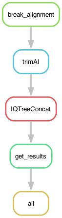

# Producing a phylogeny of the NACHT domain in the NWD family

Previous studies of the NWD family either didn't contain all genes with NACHT domain and some sort of WD40 repeats (Paoletti et al. 2007) or didn't include a phylogenetic analysis (Daskalov et al. 2012). Let's fix that.

I divided the alignment in four parts, HET and 3 chunks of NACHT. The last chunk of NACHT also contains a bit of the non-HIC WD40 domain.

## Building the environment

I am running this pipeline in MacOS so I constructed a conda environment like:

	% CONDA_SUBDIR=osx-64 mamba create -n phylogenetics -c bioconda snakemake-minimal=8.5.4 iqtree=2.2.3

Later I did

	% CONDA_SUBDIR=osx-64 mamba install biopython=1.83 -c conda-forge
	% CONDA_SUBDIR=osx-64 mamba install bioconda::trimal=1.4.1

(`CONDA_SUBDIR=osx-64` is there only to make it work in an M1/2 Mac, it can be omitted in Linux).

## Run pipeline locally

	% mamba activate phylogenetics

First, to get an idea of how the pipeline looks like we can make a rulegraph:

	% snakemake --snakefile HNWDphylogeny.smk --rulegraph | dot -Tpng > rulegraph.png

To check that the files for the pipeline are in order:

	% snakemake --snakefile HNWDphylogeny.smk -pn

Let's run it for real:

	% snakemake --snakefile HNWDphylogeny.smk -pj1 &> snakemake.log &

Something went wrong and you want to interrupt the run? Kill it!

	$ kill -s SIGINT -29795

