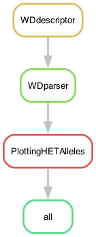

# Characterizing the repeats of *het-d*, *het-e*, and *het-r*

Here you'll find the code associated with the paper:

Ament-Velásquez et al. (2025) Reconstructing NOD-like receptor alleles with high internal conservation in *Podospora anserina* using long-read sequencing (in prep.)

----

This is a [Snakemake](https://snakemake.readthedocs.io/en/stable/) pipeline where I take a nucleotide alignment of the *het-d*, *het-e*, and *het-r* NLRs in fasta format to find, extract, and classify the WD40 repeats. The alignment includes assemblies of the same strain sequenced with different technologies.

Some amino acids have high dn/ds rations [(Paoletti et al. 2007)](https://doi.org/10.1371/journal.pone.0000283), which I use for classification but other amino acids can be chosen. Although the pipeline was designed for the *het* genes, alignments of other NWD genes should work too.

The heavy lifting is done by the script `WDdescriptor.py` that can recognize genes from the NWD family with the name in their fasta header.

In the repository you'll find:

- `HETwd40explorer.smk` -> The snakemake pipeline
- `README.md` -> this instructions
- `config/config.yaml` -> a configuration file to indicate the input fasta file, the amino acids used for classification of repeats, and the location of the scripts
- `data/2024.09.10_hnwd_master_het_reAl_Illu_noGuides_noemptycols.fa` -> The input alignment. Notice the sequences contain an intron, but the way I align them, they mantain the frame for the WD40 domain.
- `envs/plot.yaml` -> a small conda environment only used for plotting
- `scripts/PlottingHETAlleles.R` -> R script to plot, although I modified the figures in Inkscape for the publication
- `scripts/WDdescriptor.py` -> a python script that uses REGEX to find WD40 repeats with high internal conservation in NWD genes. It classifies them based on the amino acids positions set in the config file.

## Building the environment

I rely on the mamba implementation of [conda](https://docs.conda.io/en/latest/) to install software for this pipeline, which is very light so it can be easily run locally (tested on MacOS):

	$ mamba create -n hnwds -c bioconda -c conda-forge snakemake-minimal=8.26.0 biopython=1.84
	$ mamba activate hnwds

## Run pipeline locally

To run it first go to the path of the repository:

	$ cd FixingHetDE/JustHetGenes

Then activate the environment.

	$ mamba activate hnwds

To get an idea of how the pipeline looks like we can make a rulegraph:

	$ snakemake --snakefile HETwd40explorer.smk --rulegraph | dot -Tpng > rulegraph.png

To check that the files for the pipeline are in order:

	$ snakemake --snakefile HETwd40explorer.smk -pn

Let's run it for real:

	$ snakemake --snakefile HETwd40explorer.smk -pj1 --use-conda

Or

	$ snakemake --snakefile HETwd40explorer.smk -pj1 --use-conda &> snakemake.log &

Something went wrong and you want to interrupt the run? Kill it!

	$ kill -s SIGINT -29795

## Results

The pipeline produces reports describing the WD40 repeats and an R-friendly version of the report that is read by the Rscript `scripts/PlottingHETAlleles.R`. The plots in `results` were later modified in Inkscape manually for the paper's figures.

- `alignments/WDrepeats_10-11-12-14-30-32-39.fa` -- alignment that contains *all* full repeats, from all assemblies and all alleles (repeats with frame-shifts or N tracks are not included). Repeats that contain stop codons are not classified, and instead have fasta headers starting with `!`. If the header says "allkmers" or "default" then the sequence came from an Illumina assembly.

The script `PlottingHETAlleles.R` is not incorporated in the pipeline and it must be run locally instead. There we produce the distance matrices of the repeats and project them into the `l*a*b` color space.

----

Disclaimer: These scripts and files are provided "as is" and without any express or implied warranties, including, without limitation, the implied warranties of merchantability and fitness for a particular purpose.

