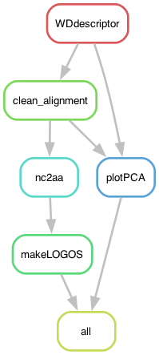

# FixingHetDE

Here you'll find the code associated with the paper:

Ament-Velásquez et al. (2025) Reconstructing NOD-like receptor alleles with high internal conservation in *Podospora anserina* using long-read sequencing (in prep.)

----

This is a [Snakemake](https://snakemake.readthedocs.io/en/stable/) pipeline where I take a nucleotide alignment of the WD40 alignment of the NWD genes to find, extract, and classify the WD40 repeats. Only alleles known to come from wildtype strains are considered.

Some amino acids have high dn/ds rations [(Paoletti et al. 2007)](https://doi.org/10.1371/journal.pone.0000283), which I use for classification but other amino acids can be chosen.

The heavy lifting is done by the script `WDdescriptor.py` that can recognize genes from the NWD family with the name in their fasta header.

In the repository you'll find:

- `NWD40explorer.smk` -> The snakemake pipeline
- `README.md` -> this instructions
- `config/config.yaml` -> a configuration file to indicate the input fasta file, the amino acids used for classification of repeats, and the location of the scripts
- `data/2025.04.14_hnwd_master_onlyWDdomain_NWDs_noGuides_noemptycols_4paper.fa` -> The input alignment. It contains only the WD40 domain (this was an unfortunate choice from my part, from before I realized I could do it with the whole unmodified gene).
- `envs/logopca.yaml` -> a small conda environment only used for plotting
- `scripts/WD40s_LOGOS.R` -> R script to plot the LOGO of all NWD genes
- `scripts/WD40s_PCA_paralog.R` -> R script to plot the PCA of all repeats genes
- `../JustHetGenes/scripts/WDdescriptor.py` -> a python script that uses REGEX to find WD40 repeats with high internal conservation in NWD genes. It classifies them based on the amino acids positions set in the config file. (it's present in the folder of the sister pipeline)

## Building the environment

I rely on the mamba implementation of [conda](https://docs.conda.io/en/latest/) to install software for this pipeline, which is very light so it can be easily run locally (tested on MacOS):

	$ mamba create -n hnwds -c bioconda -c conda-forge snakemake-minimal=8.26.0 biopython=1.84
	$ mamba activate hnwds

In addition, the pipeline will build the plotting environment using `envs/logopca.yaml`.

## Run pipeline locally

To run it first go to the path of the repository:

	$ cd FixingHetDE/NWDgenes

Then activate the environment.

	$ mamba activate hnwds

To get an idea of how the pipeline looks like we can make a rulegraph:

	$ snakemake --snakefile NWD40explorer.smk --rulegraph | dot -Tpng > rulegraph.png

To check that the files for the pipeline are in order:

	$ snakemake --snakefile NWD40explorer.smk -pn

Let's run it for real:

	$ snakemake --snakefile NWD40explorer.smk -pj1 --use-conda

Or

	$ snakemake --snakefile NWD40explorer.smk -pj1 --use-conda &> snakemake.log &

Something went wrong and you want to interrupt the run? Kill it!

	$ kill -s SIGINT -29795

## Results

The pipeline produces reports describing the WD40 repeats and an R-friendly version of the report that is read by the Rscript `scripts/PlottingHETAlleles.R`. The plots in `results` were later modified in Inkscape manually for the paper's figures.

- `alignments/WDrepeats_10-11-12-14-30-32-39.fa` -- alignment that contains *all* full repeats, from all assemblies and all alleles (repeats with frame-shifts or N tracks are not included). Repeats that contain stop codons are not classified, and instead have fasta headers starting with `!`. If the header says "allkmers" or "default" then the sequence came from an Illumina assembly.

----

Disclaimer: These scripts and files are provided "as is" and without any express or implied warranties, including, without limitation, the implied warranties of merchantability and fitness for a particular purpose.

